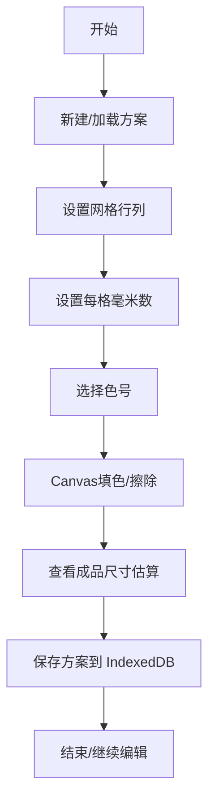

## 1. 产品概述
面向手工刺绣爱好者的纯前端方格涂色设计工具，解决绣线色号管理、成品尺寸估算、花样本地存档的核心痛点。
- 核心用途：在可缩放方格画布上按色号填色，实时换算成品尺寸，维护绣线库存，本地存储设计方案
- 目标用户：十字绣、小幅刺绣手工爱好者

## 2. 核心功能

### 2.1 功能模块
1. **主编辑器页面**：Canvas 方格画布、填色工具栏、缩放平移控制
2. **色号表面板**：绣线品牌、色号、颜色预览、库存状态管理
3. **尺寸换算面板**：每格毫米数设置、成品尺寸实时估算、布料针数参考
4. **方案列表面板**：本地方案保存、加载、重命名、删除

### 2.2 页面详情
| 页面名称 | 模块名称 | 功能描述 |
|---------|---------|---------|
| 主编辑器 | Canvas 画布 | 网格渲染、缩放（滚轮）、平移（拖拽）、点击/拖动画格填色 |
| 主编辑器 | 填色工具栏 | 当前色号显示、笔刷/橡皮/吸管工具、撤销重做、清空画布 |
| 主编辑器 | 网格参数 | 行列数设置、网格尺寸调整 |
| 色号表面板 | 色号列表 | 品牌/线号/色块/库存标签，支持增删改查 |
| 色号表面板 | 色号编辑 | 品牌选择、线号输入、颜色选择器、库存标记 |
| 尺寸换算面板 | 单位换算 | 每格毫米数输入、成品宽高(cm)实时计算 |
| 尺寸换算面板 | 布料参考 | 常见布料CT数（14CT/16CT/18CT等）自动对应毫米数 |
| 方案列表面板 | 方案管理 | 缩略图预览、名称/时间、保存/加载/重命名/删除 |
| 方案列表面板 | 新建方案 | 输入名称创建空白方案或基于当前状态另存 |

## 3. 核心流程
用户从空白画布开始，先设置网格参数和每格毫米数，选择色号在画布上填色，过程中可查看成品尺寸估算，随时保存方案到本地，也可从方案列表加载历史设计继续编辑。

## 4. 用户界面设计

### 4.1 设计风格
- **主色调**：米白底（#FAF7F2）+ 暖棕辅色（#8B6F47）+ 绣线红点缀（#C25B56）—— 呼应手工、织物、复古手账的氛围
- **按钮风格**：圆角 8px，浅木质感背景，悬停微上浮 + 阴影加深
- **字体**：标题用 "Noto Serif SC" 衬线体体现手工温度，正文用 "Noto Sans SC" 清晰易读
- **布局风格**：左侧三栏抽屉式面板（色号表/尺寸/方案），中央大画布区，顶部工具条
- **图标风格**：lucide-react 线性图标，低饱和描边

### 4.2 页面设计概览
| 页面名称 | 模块名称 | UI 元素 |
|---------|---------|---------|
| 主编辑器 | 顶部工具条 | Logo、工具切换按钮（笔/橡皮/吸管）、撤销重做、缩放百分比、保存按钮 |
| 主编辑器 | 中央画布 | 带阴影的卡片式容器包裹 Canvas，背景为亚麻纹理模拟布料 |
| 主编辑器 | 左侧面板 | 可折叠 Tab：🎨色号表 · 📐尺寸 · 📁方案，激活 Tab 底部有红色下划线 |
| 主编辑器 | 状态栏 | 底部显示：当前格子坐标、总格子数、成品尺寸、当前画布缩放比例 |

### 4.3 响应式
- 桌面优先（≥1024px）：三栏固定布局，中央画布自适应
- 平板（768-1024px）：左侧面板改为可滑出抽屉
- 移动端（<768px）：Tab 改为底部导航，画布全屏，简化工具栏

### 4.4 材质与细节
- 画布区域背景使用 CSS 重复径向渐变模拟亚麻布纹理
- 色号色块带微刺绣浮雕效果（inset box-shadow）
- 填色格子带"十字绣X"叠加层可选显示，模拟真实针脚
- 所有面板卡片使用纸质纹理 + 微噪点叠加
