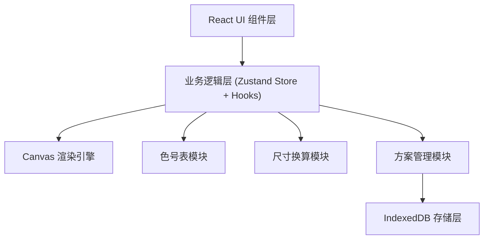
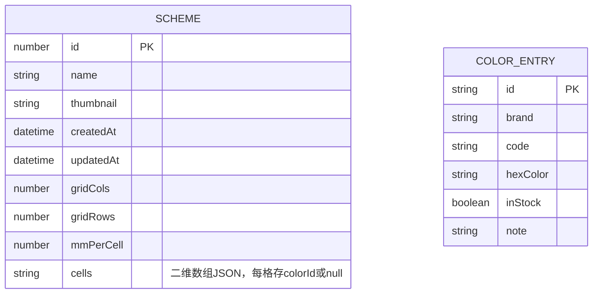

## 1. 架构设计
纯前端单页应用，分层解耦：UI 组件层调用业务逻辑层，业务逻辑层通过独立模块访问 Canvas 渲染引擎与 IndexedDB 存储层。

## 2. 技术描述
- **前端**：React@18 + TypeScript + Vite + Tailwind CSS@3 + Zustand
- **初始化工具**：vite-init（react-ts 模板）
- **后端**：无后端，纯前端
- **存储**：IndexedDB（idb 封装库）
- **图标**：lucide-react

## 3. 路由定义
| 路由 | 用途 |
|-----|------|
| / | 主编辑器页面（单页应用唯一页面） |

## 4. 数据模型

### 4.1 数据模型定义

### 4.2 IndexedDB Store 设计
- **数据库名**：stitch-design-db
- **Store 1: schemes**（方案表）
  - keyPath: id（自增）
  - 索引：name, updatedAt
- **Store 2: colors**（色号表）
  - keyPath: id（UUID 字符串）
  - 索引：brand, code

## 5. 模块职责划分

| 模块 | 文件路径 | 职责 |
|-----|---------|-----|
| Canvas 渲染引擎 | `src/engine/CanvasRenderer.ts` | 网格绘制、填色渲染、缩放矩阵、视口变换、坐标换算 |
| 色号表模块 | `src/store/colorStore.ts` | 色号 CRUD、库存管理、当前选中色号 |
| 尺寸换算模块 | `src/utils/sizeCalculator.ts` | 格数↔毫米↔厘米换算、CT数对照表 |
| 方案管理模块 | `src/store/schemeStore.ts` | 方案列表、保存、加载、删除，调用 db 层 |
| IndexedDB 层 | `src/db/index.ts` | 封装 idb，暴露 typed API：getSchemes/saveScheme/deleteScheme 等 |
| 画布状态模块 | `src/store/canvasStore.ts` | 网格数据、行列数、每格毫米数、撤销重做历史栈 |

## 6. 核心实现策略

### 6.1 Canvas 渲染
- 维护 `scale`（缩放比例）、`offsetX/Y`（平移偏移）状态
- 滚轮事件：以鼠标位置为锚点缩放，重算 offset
- 中键/空格键拖拽：更新 offset，requestAnimationFrame 重绘
- 网格数据用 `Uint32Array` 或二维数组存储 colorId，填色操作仅更新数据 + 脏矩形局部重绘
- 支持抗锯齿关闭（imageSmoothingEnabled = false）保证像素感

### 6.2 填色交互
- 左键按下 + 移动：连续填色（与当前色号相同的格子跳过）
- 橡皮工具：设为 null
- 吸管工具：点击格子读取 colorId 并设为当前色号
- 撤销重做：维护命令栈（栈内存储变更格子快照）

### 6.3 IndexedDB
- 使用 `idb` 轻量封装库提供 Promise API
- 方案保存时生成 Canvas 缩略图（缩小到 120x120）作为 base64 存 thumbnail 字段
- cells 字段用 JSON 序列化二维数组

### 6.4 尺寸换算
- 维护 CT 对照表：14CT=1.81mm, 16CT=1.59mm, 18CT=1.41mm, 22CT=1.13mm, 28CT=0.91mm
- 成品尺寸 = 格数 × 每格毫米数，自动换算为 cm 显示
